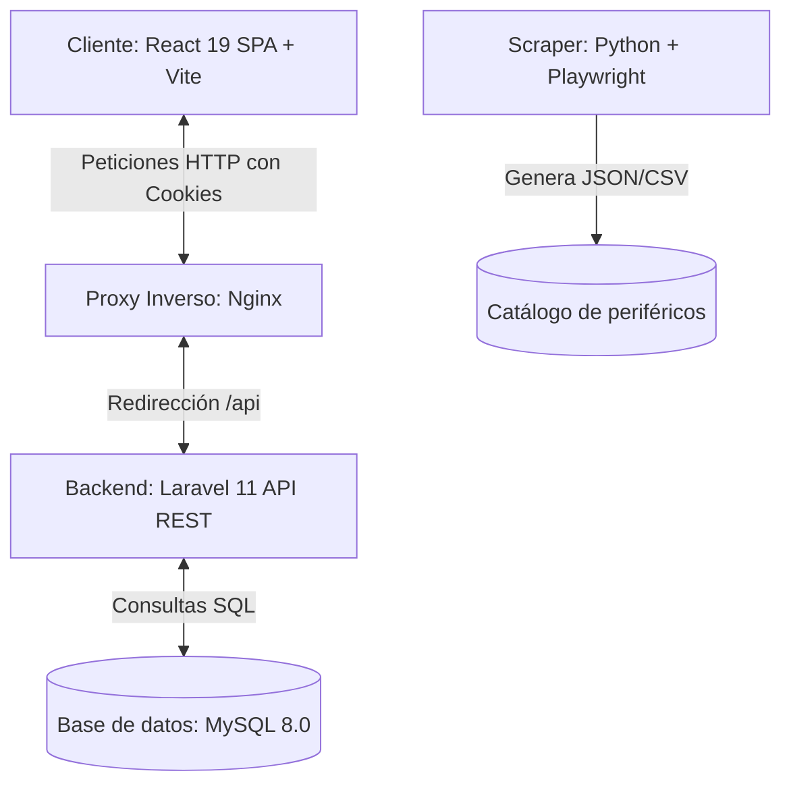

# Chuletario Técnico y Guía de Defensa (IOClickd)

Este documento es una guía rápida estructurada para entender el funcionamiento del proyecto de cara a la defensa del Proyecto de Fin de Grado (PFG) de 2º de DAW. Contiene puntos clave sobre la arquitectura, las dependencias, la comunicación front-back y las preguntas típicas de exámenes/tribunales.

---

## 1. Arquitectura General y Flujo de Datos

El proyecto funciona bajo una arquitectura desacoplada de tipo **SPA (Single Page Application) + API RESTful**:

- **Frontend**: SPA reactiva construida en [React 19](file:///g:/Clase%20DAW/DAW2/PFG/frontend/package.json), empaquetada con **Vite** y con estilos dinámicos en **SCSS**.
- **Backend**: API REST implementada con [Laravel 11](file:///g:/Clase%20DAW/DAW2/PFG/backend/composer.json) y PHP 8.4, que sirve únicamente respuestas JSON.
- **Proxy/Servidor**: **Nginx** actúa como punto único de entrada, sirviendo los archivos estáticos de React y redirigiendo las peticiones a la API de Laravel (`/api`).
- **Base de Datos**: Relacional con **MySQL 8.0**.
- **Scripting / Carga**: Un script independiente en [Python 3](file:///g:/Clase%20DAW/DAW2/PFG/python/requirements.txt) realiza el scraping de datos de ratones desde páginas de reviews para rellenar la base de datos de manera automatizada.

---

## 2. Dependencias del Proyecto y su Función

### Backend (Laravel - [composer.json](file:///g:/Clase%20DAW/DAW2/PFG/backend/composer.json))
- **`laravel/framework`**: El núcleo de la aplicación, encargado del enrutado, ORM (Eloquent), controladores, migraciones, seeders y envío de correos.
- **`laravel/sanctum`**: Biblioteca para autenticación mediante **cookies de sesión HTTP-only** (método SPA stateful) y tokens API para terceros si hiciera falta.
- **`laravel/tinker`**: Herramienta de línea de comandos para depurar e interactuar con la base de datos y modelos directamente desde consola.
- **`phpunit/phpunit` / `fakerphp/faker`** (desarrollo): Framework de pruebas unitarias y generador de datos falsos para desarrollo y pruebas.

### Frontend (React - [package.json](file:///g:/Clase%20DAW/DAW2/PFG/frontend/package.json))
- **`react` / `react-dom`**: Renderizado de componentes interactivos y control del Virtual DOM.
- **`react-router-dom`**: Enrutador en el lado del cliente (SPA) para navegar de forma instantánea sin recargar la página completa.
- **`axios`**: Cliente HTTP para comunicarse con la API REST de Laravel.
- **`sass`**: Preprocesador de CSS que permite el uso de variables globales, selectores anidados y mixins estructurados.

### Python Scraper ([requirements.txt](file:///g:/Clase%20DAW/DAW2/PFG/python/requirements.txt))
- **`playwright`**: Levanta un navegador Chromium *headless* (sin interfaz gráfica) para cargar páginas dinámicas cargadas con JavaScript.
- **`beautifulsoup4` / `lxml`**: Parsea el código HTML extraído por Playwright para buscar etiquetas y estructurar los datos del ratón.
- **`requests`**: Realiza peticiones HTTP sencillas a recursos web estáticos que no requieren ejecución de JS.

---

## 3. Flujo de un Usuario Normal (Paso a Paso)

1. **Registro e Inicio**:
   - El usuario se registra en `/register`. Se genera un registro inactivo en base de datos.
   - El backend envía un **email de verificación** firmado de forma segura. El enlace apunta al frontend: `/verify-email?id=X&hash=Y`.
   - Al hacer click, el frontend toma los parámetros y llama a la API del backend [EmailVerificationController.php](file:///g:/Clase%20DAW/DAW2/PFG/backend/app/Http/Controllers/Api/EmailVerificationController.php), marcando la cuenta como verificada.
2. **Autenticación (Login)**:
   - En `/login`, el frontend solicita un token CSRF inicial al backend (`/sanctum/csrf-cookie`).
   - Posteriormente, envía la petición de login. El backend autentica la sesión y responde instalando una cookie de sesión cifrada `laravel_session` (de tipo HttpOnly) en el navegador del usuario.
3. **Exploración**:
   - El usuario accede a `/productos`. Puede buscar periféricos por texto, filtrarlos por tipo (RATON, TECLADO, etc.) y ver especificaciones.
   - Puede acceder a `/productos/comparar-ratones` para ver tablas comparativas dinámicas lado a lado (basadas en datos del catálogo).
4. **Interacción y Gestión Personal** (Rutas protegidas por `ProtectedRoute`):
   - **Inventario**: Añade productos a su inventario personal, define la cantidad que tiene y marca uno como principal.
   - **Listas**: Crea listas de periféricos personalizadas (públicas o privadas) para compartir con otros usuarios.
   - **Reseñas**: Deja puntuaciones (1-10) y comentarios en un producto, y vota positivamente o negativamente las reseñas de otros usuarios.
   - **Soporte/Consultas**: Abre un ticket de soporte técnico. Puede chatear directamente con los agentes o administradores del sistema sobre problemas.
5. **Comunidad**:
   - El usuario puede buscar otros perfiles en `/perfiles` y seguirlos (`follow/unfollow`), lo cual le permite estar al tanto de sus inventarios y listas públicas.

---

## 4. Archivos Cruciales para la Comunicación Front-Back

Estos son los ficheros más importantes en los que se define la conexión de ambas partes:

1. **[api.js](file:///g:/Clase%20DAW/DAW2/PFG/frontend/src/services/api.js) (Frontend)**:
   - Configura Axios con `withCredentials: true` para enviar automáticamente las cookies de sesión.
   - Posee un interceptor que extrae la cookie `XSRF-TOKEN` generada por Laravel y la añade a la cabecera `X-XSRF-TOKEN` de todas las llamadas POST/PUT/DELETE.
   - Si recibe un error `401 Unauthorized` de la API, redirige automáticamente al usuario a `/login`.
2. **[AuthContext.jsx](file:///g:/Clase%20DAW/DAW2/PFG/frontend/src/context/AuthContext.jsx) (Frontend)**:
   - Mantiene el estado del usuario (`user`, `isAuthenticated`) visible para toda la aplicación React.
   - Realiza la consulta inicial a `/api/user` al cargar la web para comprobar si la sesión sigue activa.
   - Define las funciones globales `login()`, `register()` y `logout()`.
3. **[api.php](file:///g:/Clase%20DAW/DAW2/PFG/backend/routes/api.php) (Backend)**:
   - Define todos los endpoints HTTP disponibles.
   - Clasifica las rutas en públicas (registro, login, catálogo) y protegidas mediante el middleware de Laravel `auth:sanctum`.
   - Restringe el panel de administración usando el middleware personalizado `rol:ADMIN,MOD`.
4. **[app.php](file:///g:/Clase%20DAW/DAW2/PFG/backend/bootstrap/app.php) (Backend - Laravel 11)**:
   - Configura el enrutado del framework.
   - Activa `$middleware->statefulApi()` para permitir que la API funcione con cookies de sesión clásicas de PHP desde la SPA.
   - Declara el alias del middleware `'rol' => CheckRol::class`.
5. **[cors.php](file:///g:/Clase%20DAW/DAW2/PFG/backend/config/cors.php) (Backend)**:
   - Habilita las peticiones desde el origen del frontend en desarrollo (`http://localhost:5173`).
   - Define `'supports_credentials' => true`, habilitando la transmisión bidireccional de cookies.

---

## 5. Preguntas del Tribunal / Profesores y cómo responderlas

### P1: ¿Por qué usas Laravel Sanctum en lugar de JWT (JSON Web Tokens) en LocalStorage?
**Respuesta clave:**
* "Por motivos de **seguridad**. Almacenar un JWT en `localStorage` o `sessionStorage` deja al token expuesto a ataques de tipo **XSS (Cross-Site Scripting)** si un script malicioso consigue ejecutarse en el navegador."
* "Con Laravel Sanctum usamos autenticación SPA basada en cookies de sesión tradicionales cifradas de PHP. Estas cookies tienen la bandera **HttpOnly** activa, lo que significa que el motor de JavaScript del navegador no puede leerlas ni manipularlas, anulando el peligro de XSS. Adicionalmente, el middleware valida los tokens CSRF mediante cabeceras HTTP en cada petición para prevenir ataques **CSRF (Cross-Site Request Forgery)**."

### P2: ¿Qué es CORS y cómo lo has gestionado en este proyecto?
**Respuesta clave:**
* "**CORS (Cross-Origin Resource Sharing)** es un mecanismo de seguridad de los navegadores que bloquea las peticiones HTTP realizadas desde un dominio de origen (ej. `http://localhost:5173` del front) a un dominio diferente (ej. `http://localhost:8000` del back) a menos que el backend lo permita explícitamente."
* "Lo hemos gestionado en el backend mediante el archivo de configuración [cors.php](file:///g:/Clase%20DAW/DAW2/PFG/backend/config/cors.php). Indicamos que el dominio del frontend es de confianza añadiéndolo a `allowed_origins` y activamos `supports_credentials => true` para autorizar el envío de cookies de sesión entre ambos puertos."

### P3: ¿Cómo funciona el enrutado de la SPA cuando el usuario recarga la página manualmente? (Problema de las rutas SPA)
**Respuesta clave:**
* "En una SPA, la navegación (ej. `/inventario`) la gestiona React Router en el navegador mediante Javascript, sin pedir páginas al servidor. Sin embargo, si el usuario pulsa F5 (recargar), el navegador enviará una petición GET `/inventario` directamente al servidor. Si no hay nada configurado, el servidor responderá con un error 404 porque esa ruta física no existe en el backend."
* "Para solucionarlo, hemos configurado **Nginx** en [nginx.conf](file:///g:/Clase%20DAW/DAW2/PFG/docker/nginx.conf) con la directiva `try_files $uri $uri/ /index.html`. Esto redirige cualquier petición que no coincida con un archivo físico o un directorio al archivo `index.html` del frontend. Una vez cargado el index.html, React Router lee la ruta del navegador y muestra el componente correspondiente sin romper la navegación."

### P4: ¿Por qué has utilizado Playwright en el script de Python en lugar de limitarte a BeautifulSoup?
**Respuesta clave:**
* "**BeautifulSoup** es excelente para parsear HTML estático, pero no ejecuta Javascript. Hoy en día, muchas webs renderizan su catálogo de forma dinámica con frameworks como React o Vue (Client-Side Rendering)."
* "Si solo hiciéramos una petición con `requests` y la parseáramos con BeautifulSoup, el HTML estaría vacío o solo contendría un script de carga. Al introducir [playwright](file:///g:/Clase%20DAW/DAW2/PFG/python/webscrapper.py), levantamos un navegador real (*headless*), dejamos que cargue la página, ejecute el Javascript y pinte los datos de los periféricos en el DOM. Una vez renderizado el contenido, BeautifulSoup extrae la información sin problemas."

### P5: ¿Cómo funciona el middleware personalizado `rol` en Laravel?
**Respuesta clave:**
* "El middleware [CheckRol.php](file:///g:/Clase%20DAW/DAW2/PFG/backend/app/Http/Middleware/CheckRol.php) recibe una lista de roles permitidos como parámetros variables (`string ...$roles`)."
* "Cuando llega una petición HTTP a una ruta protegida, el middleware comprueba si el usuario está autenticado y si su campo `rol` coincide con alguno de los permitidos (ej. `ADMIN` o `MOD`). Si coincide, la petición continúa con `$next($request)`. Si no coincide, detiene el ciclo de vida de la petición y devuelve una respuesta estructurada con código de estado HTTP **403 Forbidden** en formato JSON."

### P6: ¿Cómo se implementa la relación N:M (Muchos a Muchos) entre productos y listas personales en base de datos y Laravel?
**Respuesta clave:**
* "**A nivel de Base de Datos**: Creamos una tabla pivot intermedia llamada `productos_en_listas` que contiene las claves foráneas `lista_id` (hacia `listas_personales`) y `producto_id` (hacia `productos`). Ambas claves forman la clave primaria compuesta de la tabla pivot."
* "**A nivel de Eloquent (Laravel)**: En el modelo `ListaPersonal` definimos un método de relación que devuelve `$this->belongsToMany(Producto::class, 'productos_en_listas')`. Esto permite a Laravel realizar los joins automáticos bajo el capó cuando hacemos consultas."

### P7: ¿Qué medidas de seguridad se aplican sobre los datos de los usuarios?
**Respuesta clave:**
* "**Contraseñas seguras**: Se encriptan mediante el algoritmo robusto **Bcrypt** antes de almacenarse en la base de datos (mediante la propiedad `casts` del modelo `User` configurando `'password' => 'hashed'`)."
* "**Protección XSS**: Uso de cookies HttpOnly que previenen el robo de sesiones por JS."
* "**Protección CSRF**: Uso de la cabecera `X-XSRF-TOKEN` provista por Sanctum."
* "**Prepared Statements**: El ORM Eloquent utiliza de forma nativa sentencias preparadas de PDO, previniendo ataques de inyección SQL (SQLi) al escapar automáticamente todos los parámetros de las consultas."

---

> [!TIP]
> **Consejo para la defensa**: Demuestra seguridad en el uso de Docker. Explica que la dockerización del proyecto asegura que cualquier desarrollador o profesor puede levantar exactamente el mismo entorno de producción/desarrollo ejecutando un simple comando (`docker-compose up -d --build`) sin preocuparse por versiones conflictivas de Node, PHP o MySQL instaladas en el sistema local.
